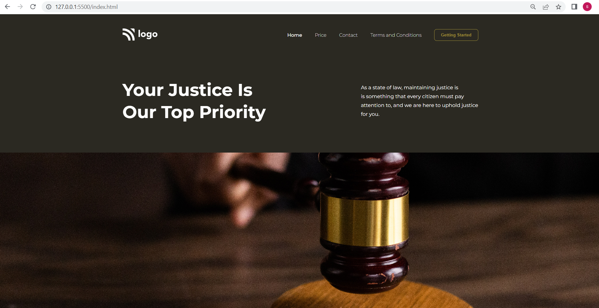

# Project 3

## Project 3 [Live Link]()

-   Skills Gained in this project
    -   Learnd to Place an image inside div.

---

## Time taken to finish this project

-   6 hour taken to complete it.

#### Screenshot

